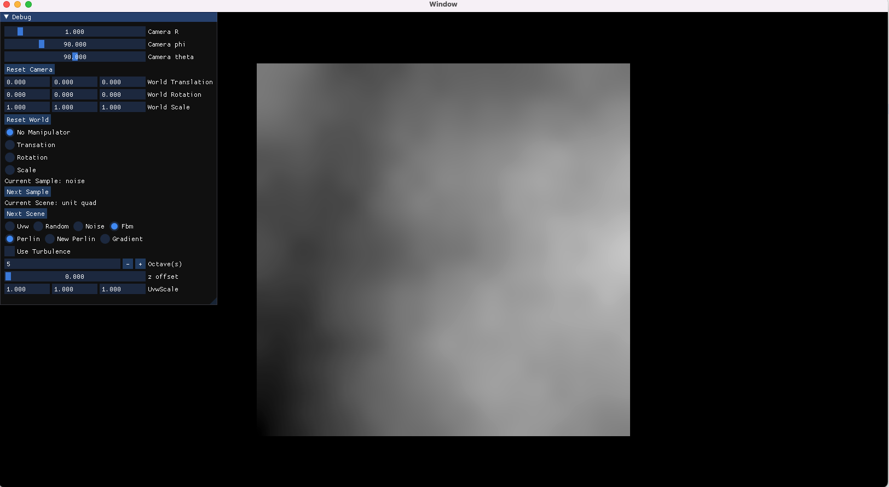
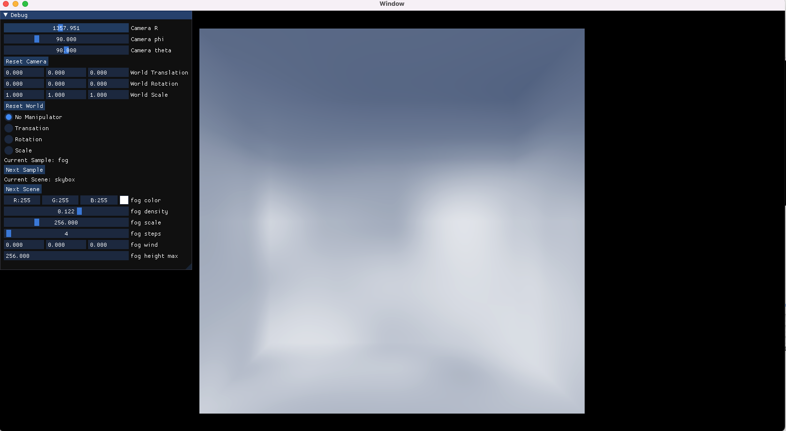

# Sample0
This program is a sample browser and set of samples using metal.  It is a work in progress
that evolves as I need it to when investigating real-time rendering techniques
using metal on macOS and iOS.  I primarily view this project as research notes in code form.
It doesn't aim to be pretty, efficient, or even an example of good code.  I try to add links
to resources I used when developing samples.
## Features
- orbit camera to manipulate the view
- world transform manipulation using gizmos
- cycle through samples
- cycle through scenes within a sample
- custom gui per sample
- triangle mesh rendering using vertex colors
- noise textures
- 3D volumetric fog
- macOS and iOS targets

## Screenshots

## Requirements
- [Dear ImGui](https://github.com/ocornut/imgui) (included in Source/ImGui)
- [ImGuizmo](https://github.com/CedricGuillemet/ImGuizmo) (included in Source/ImGui)
- Xcode

