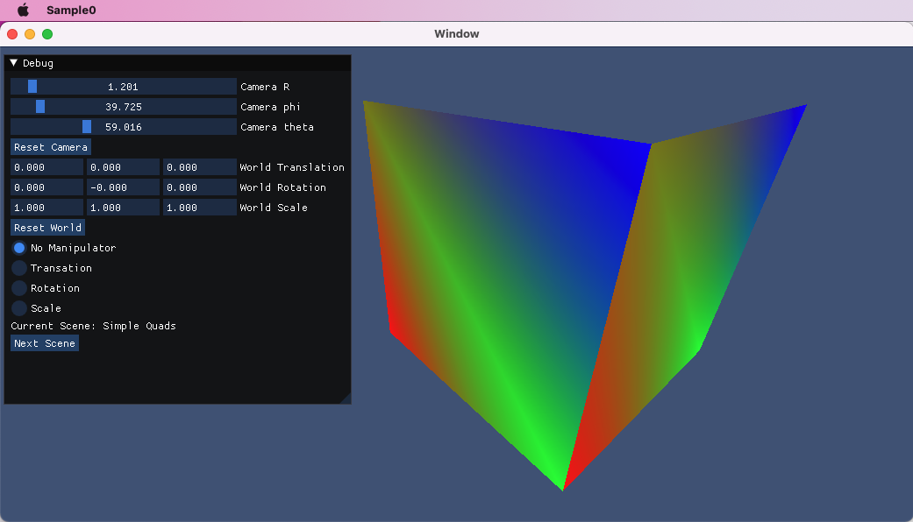
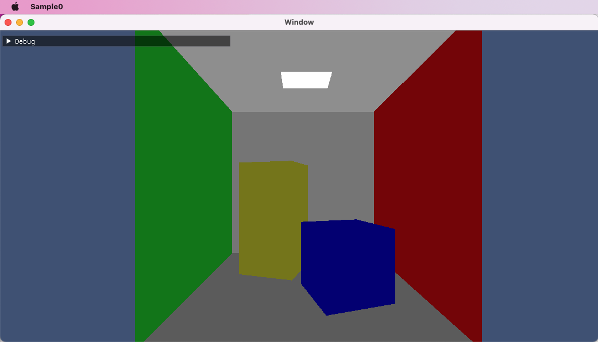

# Sample0
This program renders quad meshes (as triangles) using vertex coloring.  It has two built-in scenes: 
- two simple quads 
- a cornell box variaton.
## Features
- orbit camera to manipulate the view
- world transform manipulation using gizmos
- cycle through scenes
- macOS and iOS targets

## Screenshots

## Requirements
- [Dear ImGui](https://github.com/ocornut/imgui) (included in Source/ImGui)
- [ImGuizmo](https://github.com/CedricGuillemet/ImGuizmo) (included in Source/ImGui)
- Xcode

